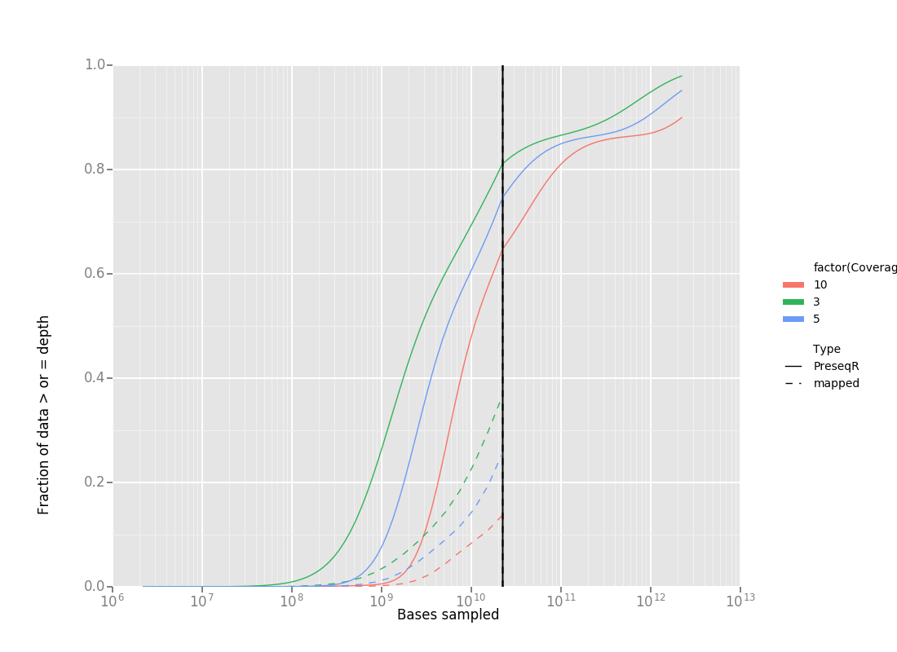

# Kmer histogram data for the development of depth coverage function in PreseqR #

##Purpose##

Kmer histogram data was generated in order to extend the the Rational Function Approximation (RFA) approach to used by Preseq (Daley and Smith, 2013)  and PreseqR (Deng et al., 2015)  to estimate sequence coverage as a function of total sequencing. The software packages Nonpareil (Rodriguez-R and Konstantinidis, 2014) and KmerSpectrumAnalyzer (Williams et al., 2013) perform related estimates, but RFA may make the approach more accurate and scalable.

## Data ##

I calculated Kmer histograms for 12 of the 14 datasets in the Nonpareil paper (Rodriguez-R and Konstantinidis, 2014) and three well-characterized metagenome datasets from the Joint Genome Institute (JGI).

Data |  Description
--- | ---
SRR061157.fastq.gz | Biosample SRS016335  Human stool
SRR061189.fastq.gz | Biosample SRS063417 Posterior fornix
SRR062429.fastq.gz | Biosample SRS019087 Human buccal mucosa
SRR062436.fastq.gz | Biosample SRS019087 Human anterior nares
SRR062519.fastq.gz | Biosample SRS015574 supragingival
SRR346700.fastq.gz | Biosample SRS062540 Tounge Dorsum
SRR948155.fastq.gz | Biosample SRP028408 Lake Lanier LL_1007B
mgm4477807.fastq.gz |Biosample PE6 Manu Park (Peru) Tropical Forest
SRR512581.fastq.gz | Biosample SRS345554 Active layer day 2
SRR512766.fastq.gz | Biosample SRS345600 Permafrost layer day 2
SRR096387.fastq.gz  |Biosample SRA029314.1  Lake Lanier LL_S2
SRR096386.fastq.gz   | Biosample SRA029309.1 Lake Lanier LL_S1
6558.7.47340.GTGAAA.fastq.gz | Wetland Surface Sediment Aug2011 Site B2 Bulk Metagenome (high complexity)
8852.1.113741.GTAGAG.fastq.gz | Crystal Bog metaG CBE16Jul07 (medium complexity)
6735.7.52359.AGTTCC.fastq.gz | Biofuel Metagenome 4 (low complexity)
MC04.fastq.gz | Mock metagenome 04 ( a mix of ~800 isolate genome fastq reads)
MC06.fastq.gz | Mock metagenome 06 ( a mix of ~800 isolate genome fastq reads)
MC13.fastq.gz | Mock metagenome 13 ( a mix of ~800 isolate genome fastq reads)
MC39.fastq.gz | Mock metagenome 39 ( a mix of ~800 isolate genome fastq reads)

##Methods##

###Generating kmer histogram data ###
For each dataset, I have placed 31-mer count histograms are in the directory `k31counts`. These data were generated using the [Bbtools](https://sourceforge.net/projects/bbmap/) package program `kmercountexact.sh`. A kmer histogram could not be calulated exactly for the high complexity sample `6558.7.47340.GTGAAA.fastq.gz` on a 248GB memory node and had to be estimated using Bbtools package program `khist.sh`, which uses a Bloom filter for approximate kmer counting. The three JGI samples are 2x150 base pair illumina libraries with a 270 base pair tareget insert size.

###Validation with mock metaenome###
The 31mer histograms were calulated for the four mock communities as described above.
MC04 was selected for further testing. The file was subsampled at 20 logrithmically distributed depths 100% -0.1% with bbmap. An Rscript was written to call PreseqR and generate a JSON of the extimated coverage depth from the 31mer histogram (coverage_est.R).  That R script is called by the python script "coverageparser.py", which loads the mapping data, runs coverage_est.R and combines the data into one graph.

###Dependencies###
coverage_est.R 
- PreseqR prerelease from [their github repo](https://github.com/smithlabcode/preseqR) (you may need the R devtools package to do this.
- R package reshape2
- R package argparser
coverageparser.py
- ggplot python package

## Current Status ##
The preseqR estimates of coverage based on 31 Mers do not currently agree with the predictions from mapping. I am investigating the reason for this.
  
---

###References###

Daley, T., and Smith, A. D. (2013). Predicting the molecular complexity of sequencing libraries. Nat. Methods 10, 325–327. doi:10.1038/nmeth.2375.

Deng, C., Daley, T., and Smith, A. (2015). Applications of species accumulation curves in large-scale biological data analysis. Quant. Biol. 3, 135–144. doi:10.1007/s40484-015-0049-7.

Rodriguez-R, L. M., and Konstantinidis, K. T. (2014). Nonpareil: a redundancy-based approach to assess the level of coverage in metagenomic datasets. Bioinformatics 30, 629–35. doi:10.1093/bioinformatics/btt584.

Williams, D., Trimble, W. L., Shilts, M., Meyer, F., and Ochman, H. (2013). Rapid quantification of sequence repeats to resolve the size, structure and contents of bacterial genomes. BMC Genomics 14, 537. doi:10.1186/1471-2164-14-537.

